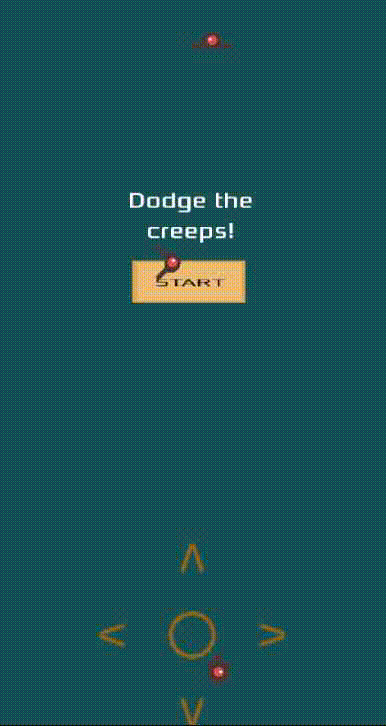

# MyDodge

## About

MyDodge is a simple 2D game made with Godot.

The goal of the game is to **avoid objects** that appear on the screen.
The player moves using a **virtual joypad**, designed mainly for **Android touch controls**.

The game has been **tested and works on Windows and Android**.

Version: **1.0.0** [Download the latest release](https://github.com/DanieAle/MyFirstTutorialGodotGame/releases/tag/v1.0.0)


---

# Building the Project

This project uses **GDNative with C++**, so you need to compile the native libraries before running the game.

## 1. Compile the Godot Headers

First go to the `godot-headers` directory:

```
cd godot-headers
```

### Android

```
scons platform=android bits=32 target=release generate_bindings=yes android_arch=arm64v8
```

### Windows

```
scons platform=windows bits=64 target=release generate_bindings=yes
```

---

## 2. Compile the Native Library

Go back to the project root:

```
cd ..
```

### Android

```
scons platform=android arch_android=modern target=release
```

### Windows

```
scons platform=windows use_mingw=true target=release
```

Windows build currently expects **MinGW**.
It is not confirmed if **MSVC** works.

---

# Important Folder

Make sure the following folder exists:

```
MyDodge/native/bin
```

If it does not exist, create it manually.
In most cases it should be created automatically by the **SConstruct** script.

---

# GDNative Library

The GDNative configuration file is:

```
MyDodge/native/gdnative/gdNativeLibraryMain.gdnlib
```

This file contains the paths to the compiled native libraries.

---

# Android Support

The Android build currently supports:

* **arm64-v8a**
* **armv7**

---

# Platforms Tested

The game has been tested and works correctly on:

* Windows
* Android
